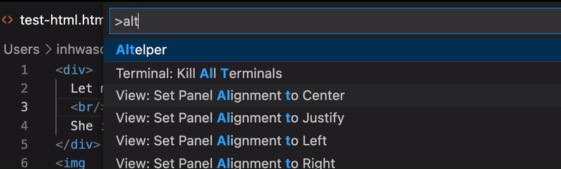

## Altelper: VScode Extension for Context Aware Image Captioning

### Step by Step Guide to Start Altelper
1. Clone the repository
2. Run `npm install`
3. Select `Start Debugging` or `^ F5` for shortcut
   
4. Create a random .html file
5. Now you can start with Altelper 🎉

*Caution*: *Altelper currently only supports HTML*

### Features
You mainly use <a href="https://code.visualstudio.com/docs/getstarted/userinterface#_command-palette">`Command Pallete`</a> interface of VScode for Altelper. 

